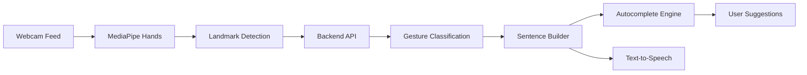

# Sign-Language-Recognition-System-with-an-AI-powered

# 🤟 SignSync — Sign Language Recognition System

> AI-powered real-time sign language recognition with NLP-based autocomplete and speech output.

---

## 🚀 Overview

SignSync is an intelligent sign language recognition system that translates hand gestures into text and speech in real time.

It combines Computer Vision (MediaPipe) + NLP (N-gram models) to not just detect signs — but predict what the user wants to say next, making communication faster and more natural.

---

## ✨ Key Features

- 🎥 Real-time Hand Tracking using MediaPipe (browser-based)
- 🧠 Gesture Classification API (custom geometric analysis)
- 💬 Smart Sentence Builder
- 🔮 Autocomplete Suggestions (Bigram + Trigram NLP)
- 🔊 Text-to-Speech Output
- 🌐 Multi-language Support (English + Hindi)
- 🕘 Sentence History (localStorage)
- ⚡ Keyboard Shortcuts (1–5) for quick selection

---

## 🏗️ Tech Stack

### 🧩 Monorepo Setup
- pnpm workspaces
- Node.js v24
- TypeScript v5.9

### 🎨 Frontend
- React + Vite  
- Tailwind CSS + shadcn/ui  
- MediaPipe Hands  
- Web Speech API  

### ⚙️ Backend
- Express 5  
- Zod (validation)  
- Orval (API codegen from OpenAPI)

### 🧠 AI / NLP
- Custom Bigram + Trigram Language Model
- Confidence-based next-word prediction

### 🗄️ Database (Optional)
- PostgreSQL + Drizzle ORM  

---

## 🧠 How It Works



---

## 📡 API Endpoints

| Method | Endpoint | Description |
|--------|---------|-------------|
| POST | /api/classify-gesture | Convert hand landmarks → word |
| POST | /api/autocomplete | Get next-word predictions |
| GET  | /api/supported-gestures | List supported signs |
| POST | /api/sentence-stats | Analyze sentence completeness |

---

## ✋ Supported Gestures

```
hello, yes, no, thank you, please, help, water, food,
I, you, want, good, sorry, stop, love, go
```

---

## 🔮 NLP Autocomplete

- Trained on conversational datasets  
- Supports English + Hindi  

Uses:
- Bigram: P(word₂ | word₁)
- Trigram: P(word₃ | word₁, word₂)

Returns:
- Top 5 predictions  
- Confidence scores  

---

## 🖥️ Project Structure

```
artifacts/
 ├── sign-language/   # Frontend (React)
 └── api-server/      # Backend (Express)
```

---

## ⚙️ Setup & Installation

### 1. Clone Repo
```bash
git clone https://github.com/Anushtha30/SignSync.git
cd SignSync
```

### 2. Install Dependencies
```bash
pnpm install
```

### 3. Run Development Servers

Frontend:
```bash
pnpm --filter @workspace/sign-language run dev
```

Backend:
```bash
pnpm --filter @workspace/api-server run dev
```

---

## 🛠️ Useful Commands

```bash
pnpm run typecheck
pnpm run build
pnpm --filter @workspace/api-spec run codegen
```

---

## 📄 Pages

| Route | Description |
|------|------------|
| / | Main translation interface |
| /guide | Gesture reference |
| /history | Sentence history |

---

## 🚀 Future Improvements

- Mobile responsiveness optimization  
- Deep Learning model (CNN/LSTM) for better accuracy  
- More language support  
- Cloud deployment (AWS/GCP)  
- User profiles + saved conversations  

---

## 💡 Why This Project Stands Out

- Combines Computer Vision + NLP + UX
- Real-world accessibility impact
- Predictive communication system (not just recognition)
- Clean monorepo architecture

---

## 👩‍💻 Author

**Anushtha Sharma** and **kashish shivhare**  

